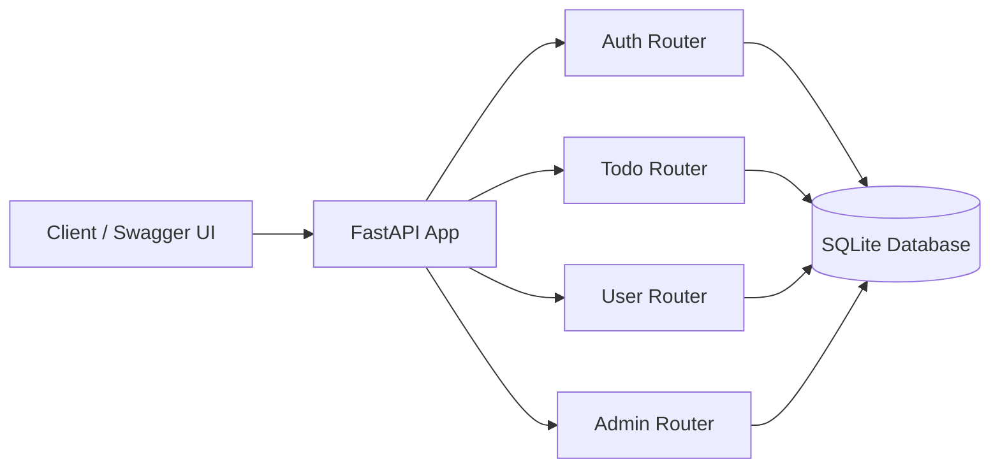

# FastAPI Todo App

This project is a simple REST API for managing personal todos with user authentication. Users can sign up, log in, create and manage their own todos, and change their password. Admin users can also view and manage all users and todos.

## What the application does

The app provides a small but complete backend workflow:

- User registration and login
- JWT-based authentication
- Personal todo management for each signed-in user
- Password change for authenticated users
- Admin-only routes for managing the whole application

## Main components

- `main.py`  
  The entry point of the application. It creates the FastAPI app and includes all routers.

- `database.py`  
  Sets up the database connection using SQLAlchemy and SQLite.

- `models.py`  
  Defines the database models for users and todos.

- `routers/auth.py`  
  Handles user creation, login, token generation, and authentication.

- `routers/todos.py`  
  Provides CRUD operations for todo items belonging to the current user.

- `routers/users.py`  
  Lets the current user view their profile and change their password.

- `routers/admin.py`  
  Gives admin users access to manage all todos and users.

## Application flow

1. A client sends a request to the FastAPI app.
2. The app routes the request to the appropriate router.
3. The router uses the database session to read or write data.
4. Authentication is checked with JWT tokens for protected endpoints.

## Architecture diagram



## How to run locally

From the project folder, run:

```bash
uvicorn main:app --reload
```

Then open the Swagger UI at:

```text
http://127.0.0.1:8000/docs
```

## Notes

- The app uses SQLite, so the data is stored locally in a file named `todosapp.db`.
- Passwords are hashed before being stored.
- JWT tokens are used to protect private routes.
